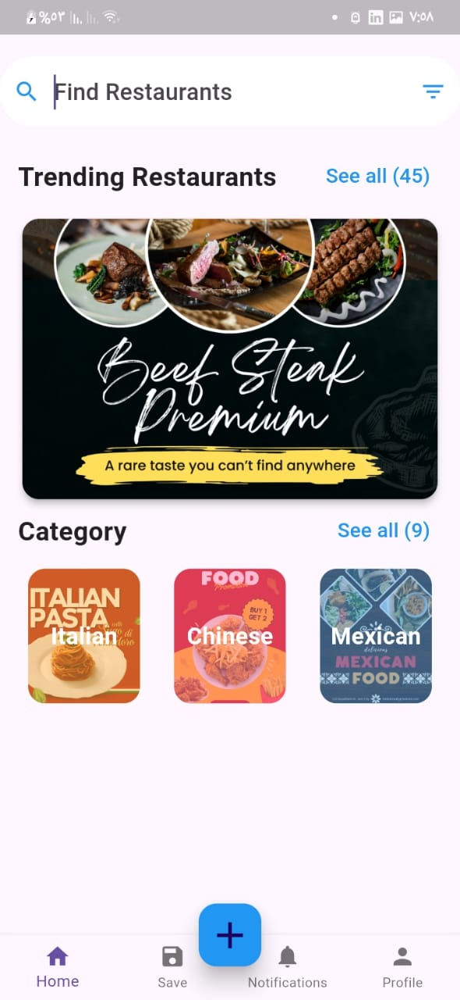

# Restaurant


**Restaurant** is a Flutter application designed to enhance the dining experience with a simple and intuitive user interface. The app allows users to explore restaurant menus, place orders, and manage their dining preferences seamlessly.

## Table of Contents

- [Features](#features)
- [Installation](#installation)
- [Usage](#usage)
- [Contributing](#contributing)

## Features

- **Browse Menus**: View detailed menus from various restaurants.
- **Place Orders**: Add items to your cart and place orders with ease.
- **Manage Orders**: Track your order status and view order history.
- **User Profiles**: Create and manage user profiles for personalized experiences.
- **Search Functionality**: Quickly find restaurants and menu items using the search feature.
- **Responsive Design**: Enjoy a smooth experience on both mobile and tablet devices.

## ⭐️ If you find this project useful, please give it a star! ⭐️
Your support helps me to keep improving and maintaining this project. Thank you!

## Installation

To get started with the Restaurant app, follow these steps:

1. **Clone the Repository**:
    ```bash
    git clone https://github.com/Islam-Ragab015/restaurant.git
    ```

2. **Navigate to the Project Directory**:
    ```bash
    cd restaurant
    ```

3. **Install Dependencies**:
    ```bash
    flutter pub get
    ```

4. **Run the Application**:
    ```bash
    flutter run
    ```

   Ensure you have Flutter installed on your machine. For installation instructions, visit the [official Flutter documentation](https://flutter.dev/docs/get-started/install).

## Usage

After running the application, you can:

- **Explore Menus**: Navigate to the menu section to view available options from different restaurants.
- **Add Items to Cart**: Select items and add them to your cart for easy ordering.
- **Place Orders**: Review your cart and proceed to checkout to place an order.
- **Track Orders**: Check the status of your orders and view past order history.
- **Search for Restaurants**: Use the search bar to find restaurants and menu items quickly.

## Screenshots of the app:

Here are some screenshots of the **Restaurant** app in action:


*Main menu and browsing options.*

## Contributing

We welcome contributions to enhance the Restaurant app! To contribute:

1. **Fork the Repository**: Create your own copy of the repository on GitHub.
2. **Create a Branch**: Develop your changes in a new branch.
    ```bash
    git checkout -b your-feature-branch
    ```
3. **Commit Your Changes**:
    ```bash
    git add .
    git commit -m "Description of your changes"
    ```
4. **Push to Your Branch**:
    ```bash
    git push origin your-feature-branch
    ```
5. **Create a Pull Request**: Submit a pull request on GitHub to propose your changes.

Please follow our coding standards and include relevant tests with your contributions.

---

Thank you for exploring the Restaurant! If you have any questions or encounter any issues, please feel free to open an issue or contact us.
